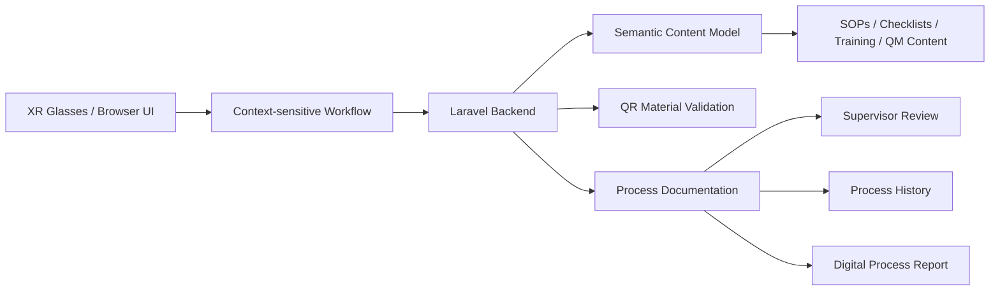

# Architecture and Compliance

This document describes the technical architecture, semantic content model, quality management evidence, role concept and compliance considerations of the AR Pharmacy Process Assistant prototype.

## Purpose

The prototype demonstrates a context-sensitive XR Pharmacy Hub for pharmacy workflows.

The goal is to show how digital content can be displayed exactly where it is needed during a pharmacy process. The executable workflow is one module of the broader XR Pharmacy Hub concept.

## System Architecture

## Semantic Content Model

The `content_items` table represents the semantic information model of the XR Pharmacy Hub.

It stores different content types:

- SOP
- checklist
- training content
- workflow template
- QM evidence
- compliance note
- role and permission concept

Each content item contains metadata:

- type
- title
- version
- valid from
- valid until
- area
- responsible role
- approval status
- process
- step number
- display context
- content

This allows digital content to be displayed depending on the current process and workflow step.

## Context-sensitive Information Display

The workflow shows related content for the current step, such as:

- related SOP
- related checklist
- training hint
- QM evidence
- responsible role
- version and validity metadata

This supports the project idea:

Digital content appears exactly where it is needed during the pharmacy workflow.

## Quality Management Evidence

The prototype creates QM-relevant evidence during the workflow:

- batch metadata
- material scan records
- completed process steps
- reported issues
- required process time usage
- supervisor review
- digital process report
- process history

## Role and Permission Concept

The current prototype does not implement a real login system. However, the intended role model is defined conceptually.

| Role | Intended permissions |
|---|---|
| PTA | Run workflows, scan materials, complete checklists, report issues |
| Pharmacist | Review process data, verify preparation quality, approve workflows |
| Supervisor | Approve or reject documented batches |
| Admin | Maintain SOPs, templates, content metadata and permissions |

## Data Protection Considerations

The prototype uses demo data only.

It does not store:

- real patient data
- real prescriptions
- real medication records
- real licensed NRF content

Stored data is limited to prototype workflow data such as demo batch IDs, process logs, QR scan results, content metadata and supervisor reviews.

## Limitations

This prototype is not a production-ready pharmacy or medical system.

Current limitations:

- no real XR glasses deployment
- no real licensed NRF content
- no real patient data
- no production-grade audit trail
- no authentication or role-based access control
- no formal validation for real pharmacy use
- no integration with pharmacy ERP systems
