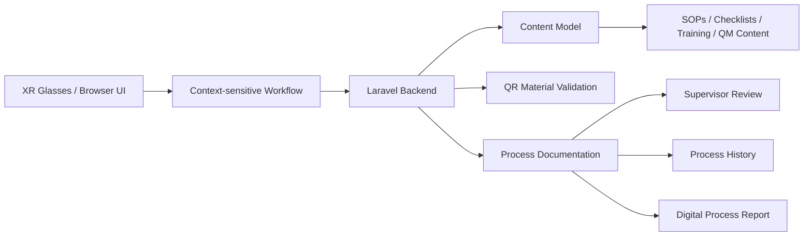

# Architecture and Compliance

This document describes the technical architecture, content model, quality management evidence, role concept and compliance considerations of the AR Pharmacy Process Assistant prototype.

## Purpose

The prototype demonstrates a context-sensitive XR Pharmacy Hub for pharmacy workflows.

The goal is to show how digital content can be displayed exactly where it is needed during a pharmacy process. The executable workflow is one module of the broader XR Pharmacy Hub concept.

## System Architecture

## Main Components

### XR UI / Browser Frontend

The frontend simulates an XR glasses interface through an AR-like browser view. It displays:

- workflow steps
- warnings
- AR hints
- required materials
- QR validation results
- checklists
- required process times
- context-sensitive content
- completion summary
- supervisor review

### Laravel Backend

The backend provides API endpoints for:

- batch creation
- recipe template loading
- material QR validation
- process log storage
- issue storage
- batch completion
- process history
- supervisor review
- context-sensitive content items

### Database

The SQLite database stores structured process and content data.

Main data structures:

- recipe templates
- recipe steps
- materials
- batches
- material scans
- process logs
- process issues
- supervisor reviews
- content items

## Semantic Content Model

The `content_items` structure represents the semantic information model of the XR Pharmacy Hub.

It can store different content types:

- SOP
- checklist
- training content
- workflow template
- QM evidence
- compliance note
- role and permission concept

Each content item contains metadata:

- type
- title
- version
- valid from
- valid until
- area
- responsible role
- approval status
- process
- step number
- display context
- content

This allows information to be displayed depending on the current process and workflow step.

## Context-sensitive Information Display

The workflow can show related content for the current step, such as:

- related SOP
- related checklist
- training hint
- QM evidence
- responsible role
- version and validity metadata

This supports the project idea:

Digital content appears exactly where it is needed during the pharmacy workflow.

## QR Material Validation

Each workflow step defines required materials. Each material has a QR code.

The system validates QR codes against:

- selected process
- current workflow step
- expected material code
- backend material database

Correct material scans are stored. Wrong material scans block the workflow and create process issues.

## Quality Management Evidence

The prototype creates QM-relevant evidence during the workflow.

Stored evidence includes:

- batch metadata
- material scan records
- completed process steps
- reported issues
- required process time usage
- supervisor review
- digital process report
- process history

This supports traceability and makes the prototype more than a visual mockup.

## Role and Permission Concept

The current prototype does not implement a real login system. However, the intended role model is defined conceptually.

| Role | Intended permissions |
|---|---|
| PTA | Run workflows, scan materials, complete checklists, report issues |
| Pharmacist | Review process data, verify preparation quality, approve workflows |
| Supervisor | Approve or reject documented batches |
| Admin | Maintain SOPs, templates, content metadata and permissions |

A production version should implement authentication, role-based access control and audit logging.

## Data Protection Considerations

The prototype uses demo data only.

It does not store:

- real patient data
- real prescriptions
- real medication records
- real licensed NRF content

Stored data is limited to prototype workflow data such as demo batch IDs, process logs, QR scan results and supervisor reviews.

A production system would need:

- user authentication
- role-based access control
- encryption
- audit logs
- retention rules
- data minimization
- access documentation
- compliance with pharmacy and data protection regulations

## Regulatory and Professional Limitations

This prototype is not a production-ready pharmacy or medical system.

Current limitations:

- no real XR glasses deployment
- no real licensed NRF content
- no real patient data
- no production-grade audit trail
- no authentication or role-based access control
- no formal validation for real pharmacy use
- no integration with pharmacy ERP or documentation systems
- no automated test suite for regulated use

## Future Work

Possible future development steps:

- integration with real XR hardware
- WebXR support
- role-based login
- admin interface for maintaining SOPs and templates
- licensed content integration
- stronger audit logging
- integration with pharmacy systems
- validation with pharmacy staff
- usability testing
- automated tests
- production deployment concept
